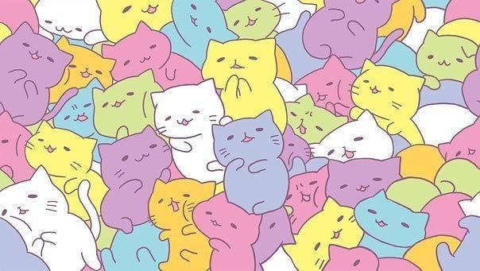
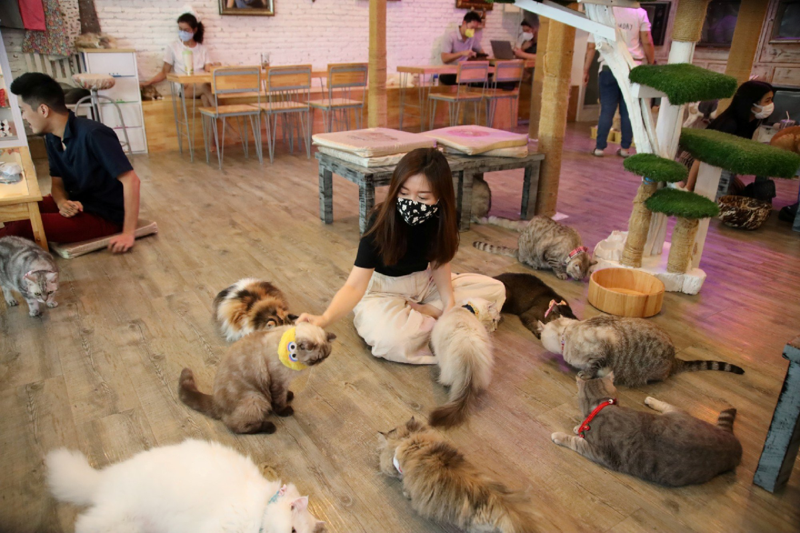
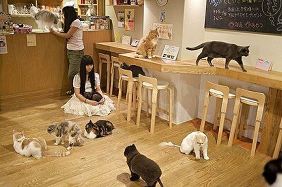
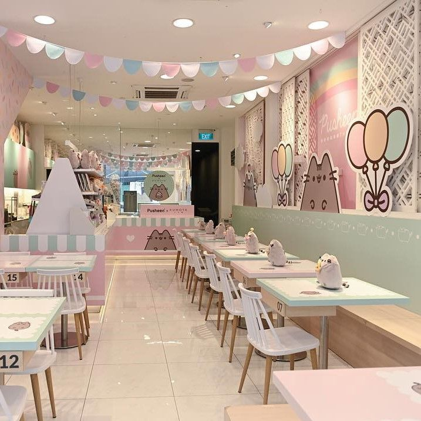
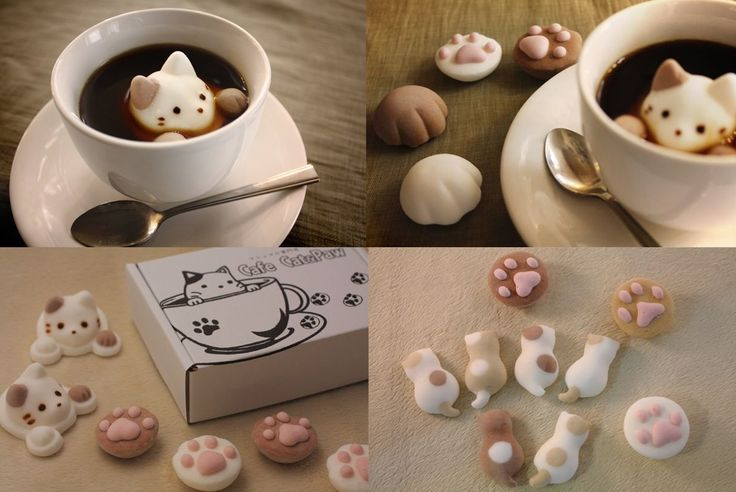

<!DOCTYPE!>
<html lang="ru">
    <body>
    This is another-page.html
    <a href="/">go back to index.html</a>
    </body>
<head>
    <meta charset="UTF-8">
    <meta name="viewport" content="width=device-width, initial-scale=1.0">
    <title>Котокафе "Лапка"</title>
    
</head>
<body>

<header>
     
    <nav>
        <a href="#help">Помочь</a>
        <a href="#contacts">Контакты</a>
        <a href="#cats">Котики</a>
        <a href="#login">Войти</a>
        <a href="#reserve">Забронировать</a>
    </nav>
</header>

<section>
    <h1>Котакафе Лапка</h1>
     
</section>

<section class="two-images">
     
     
</section>

Что интересного вы у нас найдете

Ассортимент, декор и персонал

    <h2>Декор</h2>
    
Наше кафе состоит из двух зон, украшенных кошачьими элементами. Первая зона само кафе, а вторая игровая, в которой вы можете провести время с нашими котиками.

     

    <h2>Напитки и десерты</h2>
    
В нашем кафе большой выбор горячих и холодных напитков. А также большой выбор десертов в кошачьей тематике.

     

    <h2>Наш персонал</h2>
    
В кафе вас встретят прекрасные кошко-девушки. На протяжении всего вашего присутствия они будут сопровождать и радовать вас.

     

</body>
</html>
