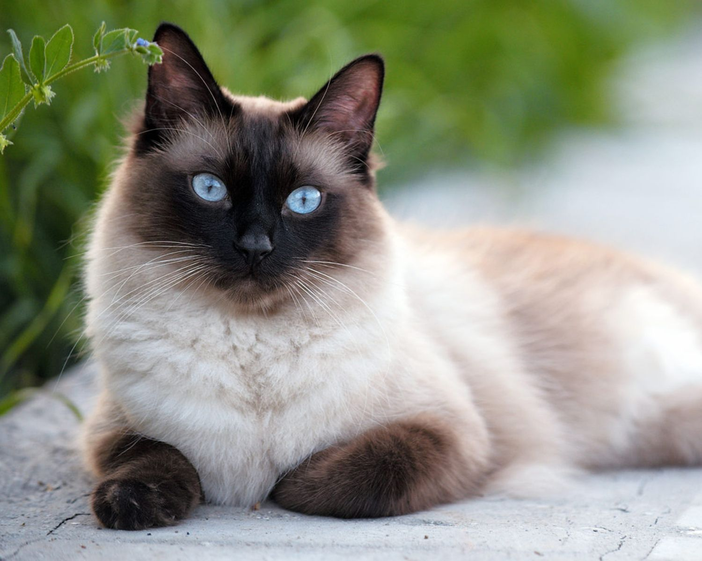

<!DOCTYPE html>
<html lang="ru">
<head>
    <meta charset="UTF-8">
    <meta name="viewport" content="width=device-width, initial-scale=1.0">
    <link rel="stylesheet" href="style/normalize.css">
    <link rel="stylesheet" href="style/main.css">
    <title>Котокафе "Лапка"</title>
    
</head>
<body>
    <header>
         
        <nav>
            <a href="#help">Помочь</a>
            <a href="#contacts">Контакты</a>
            <a href="#cats">Котики</a>
        </nav>
    </header>
    <main>
        <section>
            <h1>Добро пожаловать в Котакафе "Лапка"</h1>
             
            <a href="#our-cats" class="cta-button">Котики</a>
            <button id="helpButton" class="cta-button">Помочь</button>
        </section>
        <section class="two-images">
             
             
        </section>
        <selection>
             <h1>Что интересного вы у нас найдете</h1>
             
Ассортимент, декор и персонал

        </selection>
        

            <h1>Декор</h1>
            
Наше кафе состоит из двух зон, украшенных кошачьими элементами. Первая зона само кафе, а вторая игровая, в которой вы можете провести время с нашими котиками.

             
        

        

            <h1>Напитки и десерты</h1>
            
В нашем кафе большой выбор горячих и холодных напитков. А также большой выбор десертов в кошачьей тематике.

             
        

        

            <h1>Наш персонал</h1>
            
В кафе вас встретят прекрасные кошко-девушки. На протяжении всего вашего присутствия они будут сопровождать и радовать вас.

             
        

        <selection>
              <h1>Наши котики</h1>
              

                  

                       
                      <h1>Марципан</h1>
                      
Это элегантный и изысканный котик с очаровательной внешностью. Он очень культурный и скромный, любит играть с солнечными зайчиками и плюшевыми мышками. А его любимое лакомство лосось.

                  

                  

                       
                      <h1>Никки</h1>
                      
Это гордая и независимая кошечка. Она любит лежать на коленках у гостей и нежиться на солнышке. Если вы захотите ее угостить, то знайте, ее любимое блюдо - куриная грудка.

                  

                  

                       
                      <h1>Муро</h1>
                      
Это очень ласковый котик. Он любит спать на подоконнике, греясь на солнышке. Муро нравится, когда его гладят или чешут ему животик.  При желании можете покормить его креветками. 

                  

                  

                       
                      <h1>Клео</h1>
                      
Это очень озорная сиамская принцесса. Она очень умная кошка, которая любит играть с лазерной указкой и гладиться об ноги посетителей. А угостить ее вы можете сливочным сыром.

                  

                  

                       
                      <h1>Феликс</h1>
                      
Это важный джентльмен, любящий через окно наблюдать за птицами и играть с удочкой-дразнилкой. Он с радостью полежит у вас на коленях и погладится об все ваше тело. А если вы покормите его паштетом из креветок, он будет счастлив.

                  

                  

                       
                      <h1>Марго</h1>
                      
Очаровательная, но горделивая кошка, которая никошда сама не попросит ласки. Однако она будет рада полежать у вас на коленях. Особенно, если вы угостите ее паштетом из индейки.

                  

              

        </selection>
    </main>
    <footer>
        
&copy; 2025 Котокафе "Лапка". Все права защищены.

    </footer>
    

        
        
Если хотите помочь, позвоните нам: <strong>+7 938 908 55 13</strong>

        <button id="closePopup" class="close-btn">Закрыть</button>
    

    

    
</body>
</html>
     
